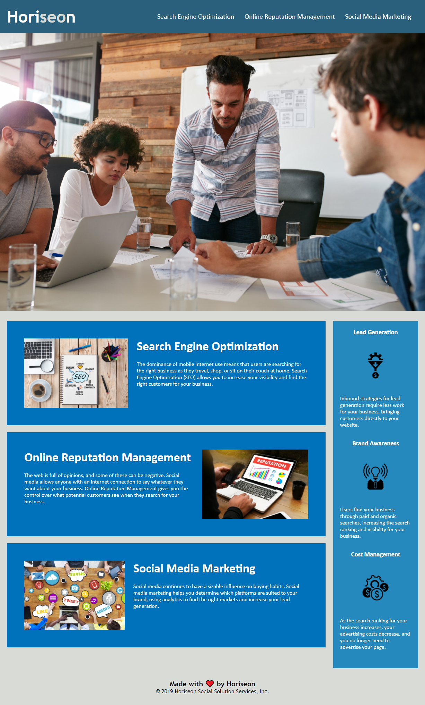

# Horiseon-Welcome-Page

## Description
Provide a short description explaining the what, why, and how of your project. Use the following questions as a guide:
- What was your motivation?\
    -This project was a means for me to practice the skills I've developed thus far as a developer.
    I was eager to learn how to bring a project in line with current best practices for accessibility,
    and to make sure it was readable on most devices.

- Why did you build this project?\
    -I built this project to ensure that users of all kinds would be able to access and read the site
    without issues. And to make any further development of the page easier and more streamlined for any
    future developers.

- What problem does it solve?\
    -This project solves a number of redundant sections, tags, and elements, by regrouping them into more
    understandable and concise styling groups. Also brings page in line with current best practice for accessibility standards to be available to a wider audience.

- What did you learn?\
    -What it means to "refactor" code
    -A general idea for the development cycle and collaborative environment which web development requires
    -Multiple unique ways to use styling to accomplish similar visual style
    -How to navigate Github and use local repositories, Bash/terminal to navigate local system and push commmits to a remote repository
    -How to maintain version control via a remote repository, and how to publish that repository via Github Pages

## Table of Contents
Click the links below to jump to that section!
- [Usage](#usage)
- [Credits](#credits)
- [License](#license)

## Usage

    -Click navigation buttons to be taken to corresponding section of the page.

   # [Click here to go to the page!](https://hdezbriant.github.io/Horiseon-Welcome-Page/)
   
   

## Credits
Huge thanks to [Christian Payan](https://github.com/chrispayan) and [Tyler Abegg](https://github.com/UnDuhDuhSea) for all their help in tweaking code and suggestions for improvements!

---

